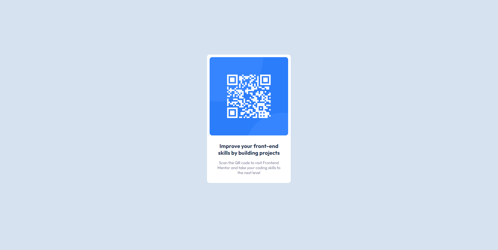

# Frontend Mentor - QR code component solution

This is a solution to the [QR code component challenge on Frontend Mentor](https://www.frontendmentor.io/challenges/qr-code-component-iux_sIO_H). Frontend Mentor challenges help you improve your coding skills by building realistic projects. 

## Table of contents

- [Overview](#overview)
  - [The challenge](#the-challenge)
  - [Screenshots](#screenshots)
  - [Links](#links)
- [My process](#my-process)
  - [Built with](#built-with)
  - [Continued development](#continued-development)
  - [Useful resources](#useful-resources)
- [Author](#author)

## Overview

### The challenge

Users should be able to:

- View the optimal layout depending on their device's screen size

### Screenshots
### Desktop

### Mobile

### Links

- Solution URL: (https://github.com/VasileDurlesteanu/qr-code-component)
- Live Site URL: (https://vasiledurlesteanu.github.io/qr-code-component/)

## My process

### Built with

- Semantic HTML5 markup
- CSS custom properties
- Flexbox

### Continued development

Focusing on strengthening the fnudamentals, such as HTML, CSS, JavaScript.

### Useful resources

- [Stackoverflow](https://www.stackoverflow.com) - This resource is an indispensable part of my coding experience.

## Author

- Website - [Vasile Durlesteanu](https://github.com/VasileDurlesteanu)
- Frontend Mentor - [@VasileDurlesteanu](https://www.frontendmentor.io/profile/VasileDurlesteanu)
- Linkedin - [Vasile Durlesteanu](https://www.linkedin.com/in/vvd888/)
